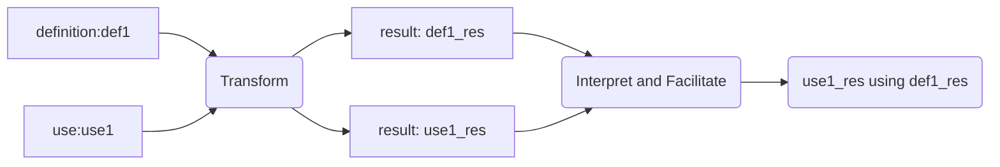

# Strict Defined Command Line Interface
## (sdcli - a notation and processing specification)

sdcli define a strict cli notation and the way it is processed. It attempts to support a set of fundamental argument types while keeping the notation simple and minimalistic.

## motivation

sdcli is the result of converging objectives. It's main objective is: how to discover, express and use a functionality being offered through a cli.

Another important objective is to use sdcli for different use scenarios, namely;

1. as a program command line interface
2. as a debug terminal command line interface
3. as a messaging layer that can be used by a protocol
3. and lastly as a management command line interface. 

sdcli does not attempt to support everything; like an exhaustive set of argument types, or checking the validity of values, or defining value types. It only knows a few argument types. Argument names and values are just strings to sdcli, which may or may not be validated by the internal software. The reasoning is that values often cannot be completely checked for their validity by the user interface alone and by not doing so, results in a much simplified interface definition.

## Primary goals

  - Specify a defined user interface (notation and its processing)
    - which is readable
    - which is type-able
    - which is minimalistic
    - which can be extensive
    - which is consistent
    - which is easily convertible to other user formats (e.g. json/xml)
    - which is efficient in terms of
      - characters required to express arguments
      - parsing complexity
    - as to express functionality and how to use it
    - as to support multiple areas of use (listed in priority order)
      - internal user interface      : debug user using terminal
      - program user interface       : program startup arguments
      - internal messaging interface : as a messaging notation and processing
      - external user interface      : management user (scripting)
    - as to support scripting

## Secondary goals

    Provide demonstration software framework in c++ (initially 03).
    - sdcli library       : c++ (03) library
    - sdcli_notation_demo : parse sdcli argument notation
    - sdcli_demo          : sdcli command notation and processing rules.

## requires

  - An argument notation syntax specification that is (mostly) complete but minimalistic.
  - A specification of how the arguments are processed.

# overview

sdcli (SDCLI) can been seen as an intelligent, efficient interpreter and facilitator between what a software (SW) offers and what a user (USER) wants to use. The software express to sdcli what it supports by specifying a command definition using the sdcli notation syntax, which is known in the rest of the text as the definition notation form, or definition notation. The user can query sdcli what functionality(s) it offers. Once sdcli is queried, it will respond by providing the user with an appropriate command definition notation, which the user then can use as a sdcli command use notation form, or short use notation. sdcli is then responsible for processing the use notation, possibly responding if it is an unsupported or illegal use notation, or transforming it into a defined, accessible notation known as the result notation, which is then passed to the software. The result notation is an internal representation of the definition notation and the use notation, which is used to define what the software must receive from sdcli.

```sequence
participant USER
participant SDCLI
participant SW
Note over SW: knows what it can do
SW->SDCLI: definition notation
Note over SDCLI: interface is now defined
Note over USER: don't know what SW can do
USER->SDCLI: empty use notation (query)
SDCLI->USER: definition notation
Note over USER: knows what SW can do
USER->SDCLI: use notation
Note over SDCLI: validate using definition
SDCLI->SW: result notation
Note over SW: use result
```

The definition, use and result notation forms are all specified using the sdcli notation syntax. The syntax notation use a very simple grammar and only few argument types. How sdcli respond to built-in commands  will be discussed in processing section. The sdcli notation is discussed and specified first.

-------------------------------------------------------------------------------------------------

# notation syntax

At the hart of sdcli is a notation used to describe arguments. An argument is identified by a unique name that has a value, type and a path. With the sdcli notation it should be possible to express any data model, both in its definition and its use, with a "short hand" form. In the text that follows, name is synonymous to argument name, and value is synonymous to argument value. There are three notation forms used by sdcli to express definition, use and result. The definition and use notation forms look very similar to one another so that the definition can easily be modified to express a certain use. Another practical consideration is to use the same parsing logic. The result notation form is what the definition and use notation forms results into and more will be said about it later.

e.g. definition, use and result notation forms
```sh
definition:
  "(person=(name=, :age=, :(male|female), telephone=))"
use:
  "(person=(name=Kate, female, telephone=1234567))"
result passed to software:
  "(argument/n{type=,name/n=,value/n=,path/n=}=
     [{/*...*/, [<person>,<female>],    [<true>],    [/*...*/]},
      {/*...*/, [<person>,<name>],      [<Kate>],    [/*...*/]},
      {/*...*/, [<person>,<telephone>], [<1234567>], [/*...*/]}])"
```

### basic notation rules
- rule1:  the syntax is written with ASCII characters and terminated with '\0'.
- rule2: all input and output are encapsulated in sdcli arguments.
- rule3: the argument notation always start with an initial argument list. "</>".
- rule4: an argument is always unique identify-able by a name, which can have an associated  value(s).
- rule5: argument names and values are just strings.

### examples
The following examples demonstrate some uses of the sdcli notation. A sdcli argument list is a c-string and is expressed as such by placing sdcli arguments within "". All the examples specify arguments within the initial argument list.

##### a mandatory argument definition

``` sdcli notation
"(queue=)"
```
Define a mandatory <queue> argument name which requires a value.

``` sdcli notation
"(queue=mq_rx1)"
```
Specify <queue> name that have a value of <mq_rx1>.

##### eg.2 an optional argument

``` sh
definition: "(:pattern=)"
  - define a list with an optional <pattern> name which requires a value
use:        "(pattern=abc*)"
  - specify a list with a <pattern> name that have a value of <abc*>
```

##### eg.3 an optional complex argument that require a value and can have two optional value parts
``` sh
definition: "(:person=:mantra:nickname)"
  - define a list with a name <person> which requires a value and have two addtional parts that are modifiedable.
use:        "(person=smith:<ignorance is bliss>)"
  - specify a list that has a <person> name that has a mandatory value of <smith> and has parts <ignorance is bliss> and <nickname>.
```

##### eg.4 a mandatory unmodifiable boolean argument
``` sh
definition: "(all)"
  - define a list with a 'all' name which is a boolean set to true.
use:        "(all)"
  - specify a list with a 'all' boolean name set to 'true'.
```

##### eg.5 an optional negate-able boolean argument
``` sh
definition: "(!debug)"
  - define a list with an optional 'debug' name which is a boolean that may be negated.
use:        "(debug)"
  - specify a list with a 'debug' boolean name set to 'true'.
```

##### eg.6 an optional bounded array argument
``` sh
definition: "(:places/3=)"
  - define a list with an optional 'places' name array which requires 3 values
use:        "(places/3 = ['new york', jerzy, paris])"
  - specify a list with an array name 'places' with three values.
```

##### eg.7 a mandatory list argument
``` sh
definition: "(customer=(name=,id=,address=, accounts/n=))"
  - define a list with a name 'customer' which is a list itself.
use:        "(customer=(name=tom,id=xx,address='happy street, hannover 8888', accounts/1=[764297]))"
  - specify a list that has a 'customer' name which is a list with values.
```

##### eg.8 a mandatory unbounded structure array argument
``` sh
definition: "(customer/n{name=,id=,address=, accounts/n=}=)"
  - define a list with a <customer> name that is an unbounded array of a fixed structure with attributes.
use:        "(customer/n{name=,id=,address=,accounts/n=}=[(Tom,51243,'home address',[88765])])"
  - specify a list that has a <customer> structure array name with a single entry of values
```

##### eg.9 an optional selection list argument with a prefix
``` sh
definition: "(:print_(all|prefix=|postfix=|pattern=))"
  - define a list with an optional selection list that is prefixed with 'print_' and has four different names to select from.
use:        "(print_all)"
  - specify a list that has a unchangable boolean name <print_all>.
use:        "(print_pattern=*trala*)"
  - specify a list that has a 'print_pattern' name that has a value of
'*trala*'.
```

##### eg.10 a mandatory selection list argument without a prefix
``` sh
definition: "((all|prefix=|postfix=|pattern=))"
  - define a list with a mandatory selection list with four different names to select from.
use:        "(all)"
  - specify a list that has a unchangable boolean name 'all' with is set to true.
use:        "(pattern=*trala*)"
  - specify a list that has a <print_pattern> name that has a value of '*trala*'.
```

#### special character table
The sdcli notation use certain ASCII characters for special purposes as demonstrated by the previous examples and listed below in the table. Names and values can use ' or < and > at the beginning and ending of a word to ignore special characters within the word. This also simplify the parsing of names and values.

| character | meaning                                                              |
| --------- | ---------------------------------------------------------------------|
| <         | mark the beginning of a word                                         |
| >         | mark the ending of a word                                            |
| (         | mark the beginning of a (option) list                                |
| )         | mark the ending of a (option) list                                   |
| ,         | name or value separator                                              |
| \|        | name separator for the option list and selection list                |
| :         | name or value is optional                                            |
| [         | mark beginning of an array values                                    |
| ]         | mark ending of an array values                                       |
| {         | mark beginning of a structure name definition or its value(s)        |
| }         | mark ending of a structure name definition or its value(s)           |
| /         | array notation when it follows a name                                |
| =         | name has a value that must be specified                              |
| !         | when a name is a boolean it can be negated                           |
| -         | used to express that a value is empty, e.g. "<>"                     |

### argument type definition
An argument has a type that depends on its name description before '='. There is one exception and that is the list argument name, which must detect '(' after '='. The list argument(6) and selection list argument(7) are composite argument types that don\`t own values themselves. Names and value parts (that always have default values in the definition notation form) can be prefixed by the ':' character to indicate an optional name or value. There is one exception, the boolean arguments cannot be optional).

| base argument type | argument definition notation |
| ------------------ | ---------------------------- |
| 1. standard        | "(name=)"                    |
| 2. complex         | "(name=:part1:part2)"        |
| 3. boolean         | "(name)", "(!name)"          |
| 4. array           | "(name/2=)"                  |
| 5. composite array | "(name/n{name1=, name2=}=)"  |
| 6. list            | "(name=(...))"               |
| 7. selection list  | "(name=name1\|name2"         |
| 8. option list     | "(prefix-(name1\|name2=))"   |

| argument definition notation   | argument use notation                         |
|--------------------------------|-----------------------------------------------|
| 1. "(name=)"                   | "(name=value)"                                |
| 2. "(name=:part1:part2)"       | "(name=value:part1:part2)"                    |
| 3. "(name)", "(!name)"         | "(name)", "(!name)"                           |
| 4. "(name/2=)"                 | "(name/2=[value1, value2])"                   |
| 5. "(name/n{name1=, name2=}=)" | "(name/n{name1=,name2=}=[{v1, v2}, {v3, v4}]" |
| 6. "(name=())"                 | "(name=())"                                   |
| 7. "(name=name1\|name2)"       | "(name=name1)", "(name=name2)"                |
| 8. "(prefix-(name1\|name2=))"  | "(prefix-name1)", "(prefix-name2=value)"      |

### result notation : `"(argument/n{type/n=,name/n=,value/n=,path/n=}=)"`

Both the definition and use notation forms shown above are visible notations that are passed and processed by sdcli. The result notation express what the definition and use notation arguments results into after parsing. This means both the definition notation and the use notation have their respective result notations. This is practical for a number of reasons; the first is that the same parsing logic can be used, the second is that comparison is much easier in the result notation and more efficient as well (the result notation is sorted) and lastly the use notation might be used independently from the definition notation. With a few simple rules the result notations of a definition and use notation can be compared, as to validate the use notation and to provide a validated, updated result notation.

The sequence diagram below express in more detail the use of the result notation form. A short hand form is used, e.g. definition:def1, to specify a use (def1) of the definition notation.

```sequence
participant USER
participant SDCLI
participant SW
Note over SW: knows what it can do
SW->SDCLI: definition:def1
Note right of SDCLI: definition:def1 transformed into result:res1
Note over SDCLI: interface is now defined
Note over USER: don't know what SW can do
USER->SDCLI: use:empty (query)
SDCLI->USER: definition:def1
Note over USER: knows what SW can do
USER->SDCLI: use:use1
Note right of SDCLI: use:use1 transformed into result:res2
Note over SDCLI: validate and update res2 using res1
SDCLI->SW: result:res2
Note over SW: use result:res2
```

#### argument: `"argument/n{...}"`

All the parsed arguments are available in the 'argument' unbounded composite array. Every name used in the definition notation or use notation must be represented as an `argument/n{...}` entry. The array is sorted on the size of the name array (less is better) and when the number of entries are the same, then sorting is based on alphabetical order of the names in the last entry.  Effectively it means the sort algorithm match the order of the arguments closely. Below is an example of a definition notation to result notation transformation.

e.g definition notation transformed into result notation
```sh
definition:
  "(name=, :age=, :(male|female), telephone=)"
result:
  "(argument/n{type=, name/n=, value/n=, path/n=} =
     [{S,  [<name],       [],       []},
      {OS, [<age>],       [],       []},
      {OZ, [-OZ1-],       [<male>], []},       /* special lookup */
      {B,  [<male>],      [],       [-OZ1-]},
      {B,  [<female>],    [],       [-OZ1-]},
      {S,  [<telephone>], [],       [L]} ])"
```
Some of the values will not make sense at this point. In the following pages the values will be described in detail. But it should be noticable that all the arguments used in the definition notation are represented within the result notation.

| argument/n (compound) types | argument type   | meaning                     |
| --------------------------- | --------------- | --------------------------- |
| 1.   argument/n{1.1-1.4}=   | composite array | arguments sorted on name/n= |
| 1.1. type/n=                | array           | specific type of argument   |
| 1.2  name/n=                | array           | full argument name          |
| 1.3. value/n=               | array           | value(s) of an argument     |
| 1.4. path/n=                | array           | full path type description  |

##### 1.1. type=S|OS|C|OC|B|OB|MB|A|OA|X|OX|L|OL|Z|OZ|H|OH

The type of an argument represent the base type and some of the properties of an argument. There are seven base argument types, namely;
1. standard (S)
2. complex (C)
3. boolean (B)
4. array (A)
5. composite array (X)
6. list (L)
7. selection list (H)
8. option list (Z)

The definition notation require an additional property to represent the optionality of an argument (type prefixed with 'O'). The boolean base argument type requires an additional property to indicate if it is a modifiable boolean value (MB). The type argument is required when the definition notation and use notation is compared and transformed into the result notation. Another use of the argument type is the path/n argument, which represents all the types of the argument's ancestor names. The path/n argument is required if the result notation should be transformed to a definition notation or use notation.

single type arguments:

|type |D/U| notation              |arg:M/O| value       | value/n             | default |
|-----|---| --------------------- |------ | ------------|---------------------| ------- |
| S   | D | "(name=)"             |   M   | any         | []                  | no      |
| S   | D | "(name=value)"        |   M   | exact       | [<value>]           | no      |
| OS  | D | "(:name=)"            |   O   | any         | []                  | no      |
| OS  | D | "(:name=value)"       |   O   | any         | [<value>]           | yes     |
| S   | U | "(name=value)"        |   -   | -           | [<value>]           | -       |
| C   | D | "(name=:part1)"       |   M   | any         | [-,<part1>]         | no      |
| C   | D | "(name=value:part1)"  |   M   | exact       | [<value>,<part1>]   | no      |
| OC  | D | "(:name=:part1)"      |   O   | any         | [-,<part1>]         | no      |
| OC  | D | "(:name=value:part1)" |   O   | any         | [<value>,<part1>]   | yes     |
| C   | U | "(name=value:part1)"  |   -   | -           | [<value>,<part1>]   | -       |
| B   | D | "(name)"              |   M   | exact       | [<true>]            | no      |
| OB  | D | "(:name)"             |   O   | exact       | [<true>]            | no      |
| MB  | D | "(!name)"             |   M   | !name, name | [<true>], [<false>] | no      |
| B   | U | "(name)"              |   -   | -           | [<true>]            | -       |
| MB  | U | "(!name)"             |   -   | -           | [<false>]           | -       |
| A   | D | "(name/2=)"           |   M   | any         | []                  | no      |
| OA  | D | "(:name/2=)"          |   O   | any         | []                  | no      |
| OA  | D | "(:name/2=[kate,mo])" |   O   | any         | [<kate>,<mo>]       | yes     |
| A   | D | "(name/2=[kate,mo])"  |   M   | exact       | [<kate>,<mo>]       | yes     |
| A   | U | "(name/2=[tom,joe])"  |   -   | -           | [<tom>,<joe>]       | -       |
| UA  | D | "(name/n=)"           |   M   | any,        | []                  | no      |
| OUA | D | "(:name/n=)"          |   O   | any,        | []                  | no      |
| OUA | D | "(:name/n=[mate])"    |   O   | any,        | [<mate>]            | yes     |
| UA  | D | "(name/n=[mate])"     |   M   | exact       | [<mate>]            | yes     |
| UA  | U | "(name/n=[mate])"     |   -   | -           | [<mate>]            | -       |
| UA  | U | "(name/n=[])"         |   -   | -           | []                  | -       |

composite type arguments:

|type |D/U| notation                         |arg:M/O| value  | value/n                 | default |
|-----|---|----------------------------------|-------|--------|-------------------------|---------|
| X   | D | "(name/2{name1=}=)"              |   M   | any    | [<0>]                   | no      |
| OX  | D | "(:name/2{name1=}=)"             |   O   | any    | [<0>]                   | no      |
| OX  | D | "(:name/2{name=}=[{one},{two}])" |   O   | any    | [<2>]                   | yes     |
| X   | D | "(name/2{name=}=[{one},{two}])"  |   M   | exact  | [<2>]                   | no      |
| X   | U | "(name/2{name=}=[{joe},{tom}])"  |   -   | -      | [<2>]                   | -       |
| UX  | D | "(name/n{name=}=)"               |   M   | any    | [<0>]                   | no      |
| OUX | D | "(:name/n{name=}=)"              |   O   | any    | [<0>]                   | no      |
| OUX | D | "(:name/n{name=}=[{one}])"       |   O   | any    | [<1>]                   | yes     |
| UX  | D | "(name/n{name=}=[{one},{two}])"  |   M   | exact  | [<2>]                   | no      |
| UX  | U | "(name/n{name=}=[{joe}])"        |   -   | -      | [<1>]                   | -       |
| UX  | U | "(name/n{name=}=[])"             |   -   | -      | [<0>]                   | -       |
| L   | D | "(name=(..n..))"                 |   M   |        | [<n>]                   | no      |
| OL  | D | "(:name=())"                     |   O   |        | [<0>]                   | yes     |
| L   | U | "(name=(..n..))"                 |   -   |        | [<n>]                   | no      |
| L   | U | "(name=())"                      |   -   |        | [<0>]                   | no      |
| Z   | D | "(pre(name1\|name2=))"           |   M   | select | [<prename1>,<prename2>] | no      |
| OZ  | D | "(:pre(name1\|name2=))"          |   O   | select | [<prename1>,<prename2>] | no      |
| B   | U | "(prename1)"                     |   -   | -      | [<true>]                | no      |
| S   | U | "(prename2=value)"               |   -   | -      | [<value>]               | no      |

##### 1.2. result argument name/n=

The name/n argument represents a specific argument name. Its an array that contains the full name path (including names of ancestors) with the last entry the name of the specific argument. This naming scheme enables the construction of named trees, tables and lists. Its also efficient in terms of the number of characters required to represent a unique full name path. The argument/n argument is sorted using the name/n argument with the intention to have a reliable, predictable order. Each argument name has a depth which is represented by the size of the argument name array.

 The c++ code snippet below is used to demonstrate the algorithm used for the sorting. The less operator is used to determine if left should be sorted before right.

```c++
  // class arg_array_t represents an argument array implemented with c++.

  bool operator<(const arg_array_t& left, const arg_array_t& right) {
  }
```

e.g. use notation transformed into result notation
```sh
use:
  "(newspaper=(name=times, date=12.03.2018, pages=89), reader=tom)"
result:
  "(argument/n{type=, name/n=, value/n=, path/n=} =
     [{L, [<newspaper>],          [<3>],          []},
      {S, [<reader>],             [<tom>],        []},
      {S, [<newspaper>, <date>],  [<12.03.2018>], [L]},
      {S, [<newspaper>, <name>],  [<times>],      [L]},
      {S, [<newspaper>, <pages>], [<89>],         [L]}])"
```

Here the 'reader' argument has a depth that is better than the 'newspaper' composite arguments. When the depth of arguments are the same, then the names are alphabetically ordered, which is the case with 'date', 'name' and 'pages'.

##### 1.3. result argument: value/n=

The value argument is used to store strings in an array that can represent any value/s. The different argument types either use one array element to store a value and others like the argument array or composite argument can store their different values within the value argument array.

The difference between a standard argument and a complex argument is that a complex argument has parts. All the argument base types use the value argument for a specific associated purpose.

A value string will have the following format:
```sh
  "(value/n=[<main_value>])"
  "(value/n=[<main_value>,<part1>,<part2>])"
  "(value/n=[<array_0>,<array_1>,<array_n>])"
```

The definition notation does not define what the value must be or how it is tested for validity, for it is the responsibility of the internal software. This design decision significantly reduce the complexity required of sdcli. The sdcli implementation may provide a value checking mechanism, it is just not part of the sdcli notation interface. This will later be addressed in more detail.

##### 1.4. result path/n=

The path/n argument represents the full path types of the full argument name. This path/n argument can be used to reconstruct the definition or use notation. But it is also used to validate the selection list for the definition and use notations. Another way to think of the path/n argument is as an internal representation of the internal types that doesn't have relevance on the ordering of arguments. The path/n argument and the type argument is used when validating definition and use notations and help resolve what the result notation will be.

e.g the [<reader>] name is composed within the initial argument list because `path/n= []` is empty.
e.g the [<newspaper>,<pages>] name is composed within the argument <newspaper> which is a list because `path/n= [L]`.

### argument transformation

definition notation : def1 -> (operation parse) -> result notation : res_def1
use notation : use1        -> (operation parse) -> result notation : res_use1
operation check & build: res_use1 compared to res_def1 to transform to res_use1
  - all arguments of res_use1(M) must be known in res_def1(N).  = MxlogN
  - can be done in one loop:
    - all mandatory arguments in res_def1 must be in res_use1.    = N (N shouldn't be huge)
    - all default values not in res_use1 must be taken from res_def1. 




### standard argument : `(type=((S|OS)))`

A standard argument has a name and use the assignment operator in the definition notation to indicate it requires a value with the use notation. There are four ways a standard argument can be used within the definition notation.

#### mandatory standard argument : `"(name=)"`

```sh
definition:        "(address=)"
definition result: "(argument/n{type=,name/n=,value/n=,path/n=}=[{S, [<address>], [],  []}])"

valid uses:
  use1:    "(address='9 Upperstreet, Tweety Town, 2345')"
  result1: "(argument/n{type=,name/n=,value/n=,path/n=}=[{[S, [<address>], [<9 Upperstreet, Tweety Town, 2345>], []}])"
```

#### optional standard argument : `"(:name=)"`

```sh
definition:        "(:address=)"
definition result: "(argument/n{type=,name/n=,value/n=,path/n=}=[{OS, [<address>], [],  []}])"

valid uses:
  use1:    "(address='9 Upperstreet, Tweety Town, 2345')"
  result1: "(argument/n{type=,name/n=,value/n=,path/n=}=[{[S, [<address>], [<9 Upperstreet, Tweety Town, 2345>], []}])"

  use2:    "()"
  result2: "(argument/n{type=,name/n=,value/n=,path/n=}=[])"
```

#### optional standard argument with default value : `"(:name=value)"`

```sh
definition:        "(:address=<parker street 10, new york>)"
definition result: "(argument/n{type=,name/n=,value/n=,path/n=}=[{OS, [<address>], [<parker street 10, new york>],  []}])"

valid uses:
  use1:    "(address='9 Upperstreet, Tweety Town, 2345')"
  result1: "(argument/n{type=,name/n=,value/n=,path/n=}=[{S, [<address>], [<9 Upperstreet, Tweety Town], 2345>, []}])"

  use2:    "()"
  result2: "(argument/n{type=,name/n=,value/n=,path/n=}=[{S, [<address>], [<parker street 10, new york>], []}])"
```

#### mandatory standard argument with mandatory value : `"(name=value)"`

When no default value is specified for a optional name, then the name does not exist in the use notation when it is not provided.

```sh
definition:        "(address=<parker street 10, new york>)"
definition result: "(argument/n{type=,name/n=,value/n=,path/n=}=[{S, [<address>], [<parker street 10, new york>],  []}])"

valid uses:
  use:    "(address='parker street 10, new york')"
  result: "(argument/n{type=,name/n=,value/n=,path/n=}=[{S, [<address>], [<parker street 10, new york>], []}])"

```

### 2. complex argument :  `"(name=:part1:part2)"`

#### mandatory complex argument : `"(name=:part1:part2)"`

```sh
definition:        "(book=:author:category)"
definition result: "(argument/n{type=,name/n=,value/n=,path/n=}=[{C, [<book>], [-,<author>,<category>]  []}])"

valid uses:
  use1:    "(book='the stand')"
  result1: "(argument/n{type=,name/n=,value/n=,path/n=}=[{[C, [<address>], [<the stand>,<author>,<category>], []}])"

  use2:    "(book='the stand':'steven king')"
  result2: "(argument/n{type=,name/n=,value/n=,path/n=}=[{[C, [<address>], [<the stand>,<steven king>,<category>], []}])"

  use3:    "(book='the stand':'steven king':fiction)"
  result3: "(argument/n{type=,name/n=,value/n=,path/n=}=[{[C, [<address>], [<the stand>,<steven king>,<fiction>], []}])"
```

#### optional complex argument : `"(:name=:part1:part2)"`

```sh
definition:        "(:book=:author:category)"
definition result: "(argument/n{type=,name/n=,value/n=,path/n=}=[{OC, [<book>], [-,<author>,<category>],  []}])"

valid uses:
  use1:    "()"
  result1: "(argument/n{type=,name/n=,value/n=,path/n=}=[])"

  use2:    "(book='the stand')"
  result2: "(argument/n{type=,name/n=,value/n=,path/n=}=[{[C, [<address>], [<the stand>,<author>,<category>], []}])"

  use3:    "(book='the stand':'steven king')"
  result3: "(argument/n{type=,name/n=,value/n=,path/n=}=[{[C, [<address>], [<the stand>,<steven king>,<category>], []}])"

  use4:    "(book='the stand':'steven king':fiction)"
  result4: "(argument/n{type=,name/n=,value/n=,path/n=}=[{[C, [<address>], [<the stand>,<steven king>,<fiction>], []}])"
```

#### optional complex argument with default value : `"(:name=value:part1:part2)"`

```sh
definition:        "(:book='the art of war':author:category)"
definition result: "(argument/n{type=,name/n=,value/n=,path/n=}=[{OC, [<book>], [<the art of war>,<author>,<category>],  []}])"

valid uses:
  use1:    "()"
  result1: "(argument/n{type=,name/n=,value/n=,path/n=}=[{[C, [<address>], [<the art of war>,<steven king>,<fiction>], []}])"

  use2:    "(book='the stand')"
  result2: "(argument/n{type=,name/n=,value/n=,path/n=}=[{[C, [<address>], [<the stand>,<author>,<category>], []}])"

  use3:    "(book='the stand':'steven king')"
  result3: "(argument/n{type=,name/n=,value/n=,path/n=}=[{[C, [<address>], [<the stand>,<steven king>,<category>], []}])"

  use4:    "(book='the stand':'steven king':fiction)"
  result4: "(argument/n{type=,name/n=,value/n=,path/n=}=[{[C, [<address>], [<the stand>,<steven king>,<fiction>], []}])"
```

#### mandatory complex argument with mandatory value : `"(name=value:part1:part2)"`

When no default value is specified for a optional name, then the name does not exist in the use notation when it is not provided.

```sh
definition:        "(book='the art of war':author:category)"
definition result: "(argument/n{type=,name/n=,value/n=,path/n=}=[{C, [<book>], [<the art of war>,<author>,<category>],  []}])"

valid uses:
  use:        "(book='the art of war':author:category)"
  use result: "(argument/n{type=,name/n=,value/n=,path/n=}=[{C, [<book>], [<the art of war>,<author>,<category>],  []}])"

```

### 3. boolean argument : `"(!name)"`

A boolean name does not have an assignment operator.  The definition notation of a boolean name use the '!' character to indicate the name may be negated. A boolean name has a default value of 'true' unless it is negated with '!' in its use notation. A boolean name can be negate-able and optional by using the '!' and ':' characters respectively and expressed as such by the definition notation, "(!:name)". A boolean name does not have an array equivalent.


### 4. array argument :  `"(name/2=)"`, `"(name/n=)"`

A simple array name can either be bounded by a fix array size, e.g. "(name/2=)" or unbounded by using "(name/n=)".  Simple array names can also be optional as simple names, by adding ':' before the name. Only fixed size simple array names can have default or mandatory values within the definition notation.  Below is an example of a mandatory name with any values.

e.g.
```sh
definition notation: "(book/n=)"
use notation:        "(book/n=['i spy', 'the stand', 'ocean of life'])"
```

Below is an example where the use notation must match the definition notation exactly, since the definition notation specify mandatory values. This feature might not be very useful but it is consistent with the simple name value definition.

e.g.
```sh
definition notation: "(book/2=[bible,koran])"
use notation:        "(book/3=[bible,koran])"
```

### 5. composite array argument : `"(name/n{name1=,name2=}=)"`

### 6. list argument : `"(name=(name=))"`

### 7. selection list argument : `"(prefix_(name1|name2=))"`

## sdcli_notation_demo

sdcli_notation_demo is a small application that demonstates how the different notation arguments are processed. When executing the application without any arguments it prints its definition notation.

e.g. sdcli_notation_demo prints is definition notation
```sh
  $ sdcli_notation_demo
(input=(:definition_notation=(), :use_notation=()), output=(:definition_notation=(result=((valid|error=)), internal_notation=(arguments/n{name=,default=,path,!negate,!optional})), :use_notation=(result=((valid|error=)), internal_notation=(arguments/n{type=,name/n=,value/n=,path/n=}))))
```
# processing

When sdcli receive a command from the user it must either be in the general invoke sdcli notation or one of its alias notation forms.  An alias notation is available, prefixed with '>', as to improve type-ability and read-ability, by reducing the amount of typing required. The alias notation support different specializations as to reduce the amount of typing even further.

### general cli synopsis:

```sh
  "(:name/n=[list], :input=(C), :settings=(A))"
```
| argument      | meaning                                            |
| ------------- | -------------------------------------------------- |
| name/n=       | an argument array specifying the command full name |
| input=()      | an argument list specifying input arguments        |
| :settings=(A) | an argument list specifying the command settings   |

### alias cli forms:

 ```sh
main alias: - execute with custom settings and input arguments.
  "> (A) name_path... command_name (C)"
same:
  "(name/n=[name_path..., command_name], input=(C), settings=(A))"

alias 1: - query with custom settings.
  "> (A) name_path... command_name"
same:
  "(name/n=[name_path..., command_name], settings=(A))"

alias 2: - execute form using input arguments and default settings.
  "> name_path... command_name (C)"
same:
  "(name/n=[name_path..., command_name], input=(C))"

alias 3: - query form with default settings.
  "> name_path... command_name"
same:
  "(name/n=[name_path..., command_name])"
 ```

### builtin commands

There are three built-in commands that sdcli support at all times, namely;
 1. help   : help on help, help on commands and inputs
 2. list   : list all commands
 3. config : configure the cli session.

#### help : `"help (A)"`

general cli form: `">(name/n=[<help>], input=(A))`

#### list : `"list (A)"`

general cli form: `">(name/n=[<list>], input=(A))`

#### config : `"config (A)"`

general cli form: `">(name/n=[<config>], input=<A>)`


```sh
">(name/n=[muticast, createvlan], input=(vlanid=,vlanidx=,:settings=(snoopmode_(discard|forward),version_(v1|v2|v3),txprio_(cos0,cos1,cos2,cos3,cos4,cos5,cos6,cos7),enable_all_groups_(on, off))))"

"multicast createvlan (vlanid=,vlanidx=,:settings=(snoopmode_(discard|forward),version_(v1|v2|v3),txprio_(cos0,cos1,cos2,cos3,cos4,cos5,cos6,cos7),enable_all_groups_(on, off)))"

```
